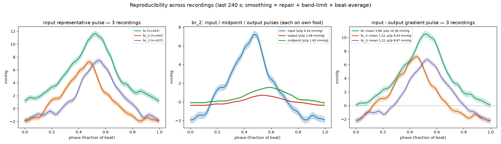

# MPRLS pressure-waveform smoothing & gradient

Smooth noisy MPRLS bioreactor pressure recordings **based on what the signal
likely is**, and compute the **input → output pressure gradient**.

Three MPRLS sensors record a pulsatile-perfused bioreactor:

| channel | column | role |
|---|---|---|
| **input** | `pressure_mmhg_1` | flow-through channel near the pump |
| **output** | `pressure_mmhg_2` | the other flow-through channel |
| **midpoint** | `pressure_mmhg_3` | midpoint tap |

The input and output are **separate flow-through channels in the same gel block,
joined externally by a long U-bend** — not two ends of one pipe — so they are
partly *phase-decorrelated* (this matters below).

## The idea — smoothing from the signal's structure

The raw traces are buried in broadband **vibration noise** (present at every pump
speed while liquid is pushed through). But the pulse is highly structured, and
that structure is exactly what lets us smooth it without inventing anything:

* **quasi-periodic** at one fundamental `f0` ≈ 1.76 Hz (**~105 bpm**, matching the
  expected 100–105);
* **multiphasic**, so the shape lives in `f0` and a *few* harmonics (2–4;
  negligible beyond ~5·`f0` on the clean channels);
* the vibration is **broadband and stationary** — no discrete tone to notch,
  it just fills the spectrum above (and under) the harmonics.

So "meaningful smoothing" = **band-limit to the pulse fundamental + first few
harmonics**, plus artifact repair, with two complementary tools:

1. **Zero-phase band-limited low-pass** (`smooth_pressure`) — a Butterworth
   `filtfilt` with cutoff at `n_harmonics · f0` (~7 Hz). Zero-phase preserves
   feature *timing* (a phase shift would corrupt the channel-to-channel
   gradient). This de-noises the **continuous** trace.
2. **Beat-synchronous (ensemble) averaging** (`ensemble_average`) — the strongest
   denoiser here. Because the signal repeats every beat, averaging hundreds of
   beats onto a common phase axis beats the *broadband* noise down by
   ~√(n_beats) (~20× over ~400 beats) and yields one clean **representative
   pulse** per channel with a beat-to-beat scatter band.

Before either, the **input channel is repaired**: MPRLS I²C reads occasionally
drop out (NaN, ~0.1–2 %) — interpolated (`fill_dropouts`) — and occasionally
spike — rejected with a Hampel filter (`hampel_filter`).

### Why the representative pulse is *averaged*, not *low-passed*

A low-pass strong enough to remove the vibration also **rings** on the sharp
systolic upstroke, planting an artefactual "notch" at the peak. Ensemble
averaging removes the same noise with **no ringing**, so the representative pulse
is built from the *repaired-but-not-low-passed* signal and then gently smoothed in
the **phase domain** (`smooth_template`, a periodic Savitzky-Golay whose window is
much wider than any real feature). The recovered pulse is a smooth, asymmetric,
mildly multiphasic wave with **no dicrotic notch** — the asymmetry, not a notch,
is the multiphasic content.

## The gradient

* **Instantaneous gradient** `g(t) = input − output` of the two smoothed channels
  — the momentary pressure difference.
* **Mean (DC) gradient** — the baseline pressure drop driving flow. The recordings
  are zeroed at no-flow, so this is a real baseline-referenced difference.
* **Representative gradient pulse** — `g(t)` **ensemble-averaged on its own beats**
  (a single self-referential average), *not* a beat-locked subtraction of two
  channels. The channels are phase-decorrelated (magnitude-squared coherence at
  `f0` ≈ 0.3–0.4), so the decorrelated output pulsation averages toward its mean
  (it contributes to the DC drop, not the pulse). The gradient pulse is therefore
  the honest pulsatile pressure difference, dominated by the input-side pulsation.

## Use

```bash
mp-pressure-gradient -i recording.csv -o results/          # last 240 s by default
mp-pressure-gradient -i recording.csv -o results/ --last-seconds 0   # whole file
mp-pressure-gradient -i recording.csv -o results/ --start-s 90 --end-s 320
```

```python
from mprls_pressure import analyze_pressure_csv
a = analyze_pressure_csv("recording.csv", last_s=240)
print(a.summary())
g = a.gradient
print(g.mean_gradient, "mmHg mean;", g.pulsatile_amplitude, "mmHg pulsatile")
```

The recordings have a **startup transient**, so the analysis defaults to the
**final 240 s** — a continuous, steady-flow window. (`--last-seconds`,
`--start-s`/`--end-s` to change it.)

### Outputs (written to `-o`)

| File | Contents |
|---|---|
| `pressure_analysis.png` | Headline figure: raw-vs-smoothed, spectra with the removed band, per-channel representative pulses, instantaneous gradient, representative gradient pulse |
| `pressure_pulses.png` | Two-panel view: the per-channel representative pulse and the input−output gradient pulse (with SEM) |
| `pressure_smoothed.csv` | Per-sample smoothed channels + instantaneous gradient on the common time grid |
| `pressure_representative_pulse.csv` | Beat-averaged pulse of each channel + the gradient pulse (phase, mean, SD) |
| `pressure_summary.txt` | The metrics block |

### Key options

| Flag | Default | Meaning |
|---|---|---|
| `--last-seconds` | `240` | Analyse only the final N s (steady-flow window). `0` = whole file |
| `--start-s` / `--end-s` | — | Explicit window in `elapsed_s` (overrides `--last-seconds`) |
| `--min-bpm` / `--max-bpm` | `60` / `180` | Fundamental search band (pulses/min) |
| `--harmonics` | `4` | Pulse harmonics kept — low-pass cutoff = `harmonics · f0` |
| `--hampel-nsigma` | `5` | Spike-rejection threshold in robust SDs (higher = gentler) |

## Metrics

* **pulse rate** — fundamental `f0`, in bpm; the median of the per-channel
  estimates (all sensors see the same pump, so disagreement is noise).
* **mean gradient (DC)** — time-averaged `input − output`, mmHg.
* **pulsatile gradient** — peak-to-peak of the representative gradient pulse.
* **beat-locked fraction (coherence)** — fraction of a channel's in-band variance
  that repeats every beat (~15–25 % here; the rest is incoherent vibration — which
  is *why* averaging, not single beats, is required).
* **in-out coherence @f0** — magnitude-squared coherence of input and output at
  `f0` (~0.3–0.4: the two flow paths are largely decorrelated).

## Result on the three provided recordings (last 240 s)

| recording | pulse rate | mean gradient | pulsatile gradient | in-out coh @f0 |
|---|---|---|---|---|
| `br`   | 105.5 bpm | 3.98 mmHg | 10.4 mmHg p2p | 0.43 |
| `br_2` | 105.5 bpm | 1.22 mmHg |  9.4 mmHg p2p | 0.35 |
| `br_3` | 105.5 bpm | 1.22 mmHg |  8.9 mmHg p2p | 0.28 |

The pulse rate is recovered identically across all three, the representative pulse
shape reproduces across recordings, and the input-side pulsation dominates the
gradient. `br_2` and `br_3` agree on the mean gradient (1.22 mmHg); `br` is a
separate run with a larger drop.

`results/` holds a worked example: `reproducibility.png` (below), one headline
figure (`br_2_analysis.png`), and the three `*_summary.txt`.



## Method notes & where to extend

* **Fundamental** — Hann-windowed zero-padded FFT, median across channels
  (rejects per-channel modulation sidebands).
* **Repair** — linear dropout interpolation; Hampel (median/MAD) spike rejection.
* **Continuous smoothing** — zero-phase Butterworth low-pass at `n_harmonics·f0`.
* **Representative pulse** — ensemble average of the repaired signal + phase-domain
  Savitzky-Golay (ring-free); SEM shows how well the mean pulse is determined.
* **Gradient** — instantaneous difference; representative gradient pulse from a
  self-referential ensemble average of `g(t)`.
* **Independent cross-check (optional)** — the sibling `pulsatility` tool extracts
  a pulse waveform from bioreactor *video* via optical flow; it can confirm the
  rate independently, but is not needed for the smoothing or the gradient (signal
  and noise separate within the pressure data by band + beat-locking).
