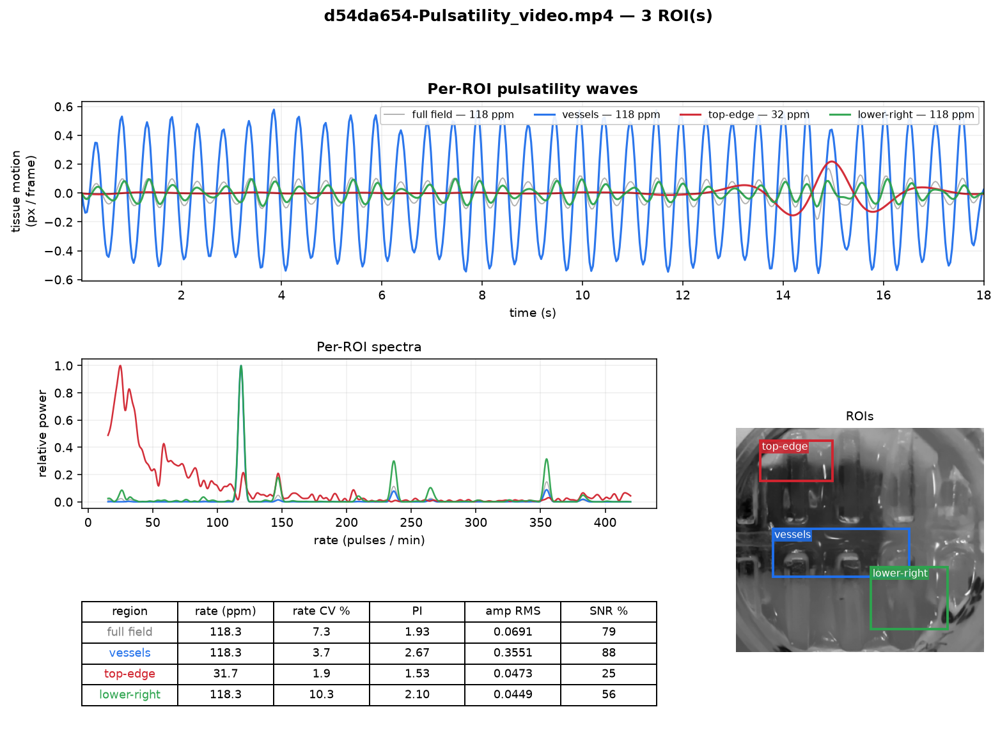
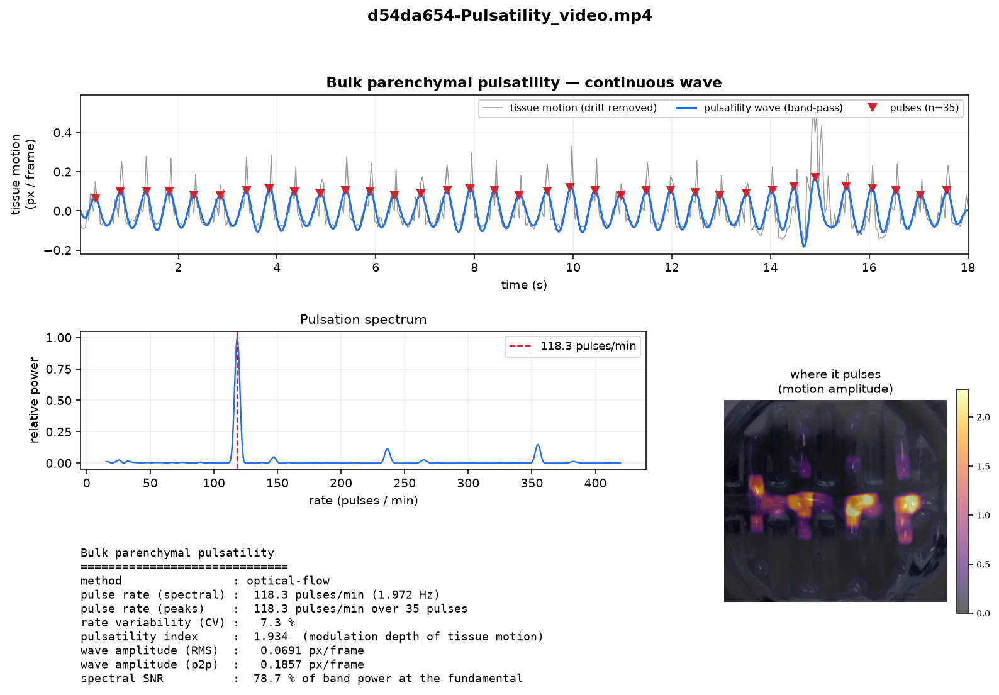

# Pulsatility quantification

A self-contained tool that turns a brightfield / surgical-microscopy **video** of
perfused parenchyma into a **bulk pulsatility waveform** — a continuous wave
showing how the tissue moves with each pulse of the perfusing flow — plus the
pulse rate, a pulsatility index, and a spatial map of where the tissue pulses
most.

Built for a gel block perfused from above by pulsatile flow through embedded
vessels, and designed to carry over unchanged to a forthcoming neurosurgical
video of brain parenchyma.

## The idea

Each pulse of the perfusing flow briefly pressurises the embedded vessels and
nudges the surrounding parenchyma. In the video this appears as tiny, spatially
coherent **motion** of the tissue. We measure that motion frame-to-frame with
dense optical flow and take the mean flow *magnitude* per frame as a
"tissue-speed" signal — it rises and falls once per pulse, which is the
continuous wave we want.

Working from **motion** rather than raw brightness is deliberate:

* it is robust to the **oblique filming angle** (we measure in-plane tissue
  displacement, whatever the viewing geometry — a caveat, not a blocker);
* it is robust to slow **illumination drift / bleaching**, which swamp a naive
  mean-intensity signal (in the sample video the intensity signal is
  drift-dominated while the motion signal is a clean 2 Hz pulse train);
* nothing about it is gel-specific — it finds whatever coherent pulsation is
  present, so the same call works on brain parenchyma.

## Install

The tool ships as part of this repo and uses only existing dependencies
(`opencv-python`, `numpy`, `scipy`, `matplotlib`):

```bash
pip install -e .
```

## Use

```bash
mp-pulsatility -i Pulsatility_video.mp4 -o results/
```

or from Python:

```python
from pulsatility import analyze_pulsatility_video

result = analyze_pulsatility_video("Pulsatility_video.mp4", "results/")
print(result.summary())
print(result.bpm_spectral, "pulses/min")
```

### Outputs (written to the `-o` directory)

| File | Contents |
|------|----------|
| `pulsatility_analysis.png` | Headline figure: the continuous pulsatility wave, the pulse spectrum, the spatial amplitude map, and the metrics |
| `pulsatility_waveform.csv` | Per-frame signal: `time_s`, `tissue_motion_px_per_frame`, `detrended`, `pulsatility_wave`, `is_pulse_peak` |
| `pulsatility_amplitude_map.png` | Standalone "where it pulses" heatmap over a reference frame |
| `pulsatility_summary.txt` | The text metrics block |

### Key options

| Flag | Default | Meaning |
|------|---------|---------|
| `--method {flow,diff}` | `flow` | `flow` = dense optical-flow tissue speed (robust); `diff` = mean absolute frame difference (faster, but conflates brightness change with motion) |
| `--resize-width` | `320` | Downscale width before analysis. Pulsatility is a bulk, low-spatial-frequency phenomenon, so downscaling denoises and speeds up flow without losing signal. `0` keeps full resolution |
| `--min-bpm` / `--max-bpm` | `30` / `300` | Bounds of the pulse-rate search (pulses per minute). Cardiac brain rates (~40–120 bpm) sit comfortably inside the default |
| `--fps` | from file | Override the frame rate if the container metadata is wrong |
| `--frame-stride` | `1` | Analyze every Nth frame (fps scaled accordingly) |
| `--pixel-size-um` | — | If given, wave amplitudes are additionally reported in µm/s |
| `--stabilize` | off | Remove global camera / scope shake before analysis (ECC align each frame to a reference). Strongly recommended for hand-held / surgical video |
| `--stabilize-mode` | `euclidean` | Stabilization transform: `translation`, or `euclidean` (translation + rotation) |
| `--roi` | — | A region-of-interest rectangle to measure separately. **Repeatable, up to 8.** See below |
| `--roi-units` | `pixel` | Whether `--roi` coordinates are original-video pixels or `fraction`s (0–1) of the frame |
| `--roi-mask` | — | A label image whose distinct non-zero values each define an ROI (for hand-drawn / non-rectangular regions) |

## Regions of interest (up to 8)

By default the tool measures pulsatility over the **whole frame**. Often you want
it for **specific regions** instead — a patch of parenchyma next to a vessel vs.
one further away, left vs. right hemisphere, or to *exclude* a big vessel,
surgical instrument or gauze that would otherwise dominate the signal. You can
give up to **eight** ROIs; each is analysed independently and the whole field is
always included as a reference.

### How to use it

Pass one `--roi X,Y,W,H` per region (repeat for more), where `X,Y` is the
top-left corner and `W,H` the width/height **in pixels of the original video**
(the numbers you read off the video in any player, ImageJ, QuickTime, etc.).
Give each a name with a `name=` prefix so the plots and table are labelled:

```bash
mp-pulsatility -i Pulsatility_video.mp4 -o results_roi/ \
    --roi "vessels=150,420,570,200" \
    --roi "top-edge=100,50,300,170" \
    --roi "lower-right=560,580,320,260"
```

If you'd rather not read pixel coordinates, use fractions of the frame
(`0,0` = top-left, `1,1` = bottom-right):

```bash
mp-pulsatility -i video.mp4 -o out/ --roi-units fraction \
    --roi "center=0.35,0.4,0.3,0.25" --roi "corner=0.0,0.0,0.25,0.25"
```

For **non-rectangular** regions (e.g. tracing a gyrus), paint a *label image* the
same size as a video frame — background 0, region 1 in one grey level, region 2
in another, and so on (up to 8) — save it as PNG and pass `--roi-mask labels.png`.
Draw it in ImageJ/Fiji, Photoshop, GIMP or napari; the values just need to be
distinct.

From Python:

```python
from pulsatility import analyze_pulsatility_video

r = analyze_pulsatility_video(
    "video.mp4", "out/",
    rois=["vessels=150,420,570,200", "edge=100,50,300,170"],  # up to 8
    roi_units="pixel",           # or "fraction"
    # roi_mask="labels.png",     # alternative: a hand-drawn label image
)
per_roi = r.extras["roi_results"]          # dict: name -> PulsatilityResult
print(per_roi["vessels"].bpm_spectral, per_roi["vessels"].pulsatility_index)
```

### Picking good coordinates without a GUI

This tool is headless (no click-to-draw window), so the intended workflow is:

1. **Run once with no ROI.** The `pulsatility_amplitude_map.png` ("where it
   pulses") shows exactly where the tissue moves most — read approximate box
   coordinates off it.
2. **Add `--roi` boxes** over the regions you care about and re-run.
3. **Check placement.** Every ROI run writes `pulsatility_rois.png` with your
   boxes drawn on a reference frame, so you can nudge the numbers and repeat.

### Extra outputs when ROIs are given

In addition to the whole-field artifacts above, an ROI run also writes:

| File | Contents |
|------|----------|
| `pulsatility_rois.png` | Comparison figure: overlaid per-ROI waves, overlaid spectra, the reference frame with labelled ROI boxes, and a metrics table |
| `pulsatility_roi_waveforms.csv` | Time column + the pulsatility wave and raw motion of every region (whole field + each ROI) |
| `pulsatility_roi_summary.txt` | Per-region metrics table (rate, CV, PI, amplitude, SNR, pulse count) |

`results_roi/` in this folder holds a worked example (the three ROIs above): the
`vessels` box shows ~8× the wave amplitude and a far cleaner spectrum (88% SNR)
than the quiet `top-edge` box (25% SNR, no coherent pulse) — exactly the kind of
region-to-region contrast the multi-ROI mode is for.



## Comparing conditions & large / 4K videos

To compare pulsatility **across videos** (e.g. an *in vivo* recording vs. a
bioreactor, or gel vs. brain), analyse each and pass the results to
`plot_pulsatility_comparison`, which overlays the waves and spectra and shows
each video's amplitude map + metrics side by side:

```python
from pulsatility import analyze_pulsatility_video, plot_pulsatility_comparison

a = analyze_pulsatility_video("Human.MOV", "out/human", rois=["cortex=0.40,0.23,0.33,0.58"],
                              roi_units="fraction", frame_stride=2)
b = analyze_pulsatility_video("Bioreactor.MOV", "out/bio", rois=["chamber=0.20,0.26,0.52,0.50"],
                              roi_units="fraction", frame_stride=2)
plot_pulsatility_comparison(
    {"Human — cortex":     a.extras["roi_results"]["cortex"],
     "Bioreactor — chamber": b.extras["roi_results"]["chamber"]},
    "out/comparison.png")
```

For **large / high-frame-rate videos** (the surgical and bioreactor clips are 4K
at 50 fps), two options keep runtime and memory in check:

* `--frame-stride N` analyses every Nth frame and **skips decoding** the rest
  (via `cv2.grab()`), so a stride of 2 roughly halves the decode cost. The
  effective frame rate is divided by N — keep it well above twice the expected
  pulse rate (stride 2 → 25 fps handles any cardiac rate).
* `--max-frames M` caps the analysed window; a matched window across conditions
  makes the comparison fair.

A practical tip for oblique, real-world footage: measure inside an ROI on the
actual parenchyma. Whole-field motion there is dominated by camera shake,
instruments and harmonics — on the surgical clip the whole frame reports ~146
ppm (the 2nd harmonic) while a cortex ROI recovers the true ~73 ppm cardiac
rate.

## Stabilization (`--stabilize`)

Hand-held or surgical-scope video shakes. That whole-field camera motion adds a
spurious *uniform* flow to every pixel each frame, which swamps the subtle local
pulsation. `--stabilize` estimates a global rigid transform (translation, or
translation + rotation) from every frame to a reference frame with ECC and warps
it back — cancelling the shake while leaving *local* tissue deformation (the
pulsatility) intact. It is cheap (~4 ms/frame) and often decisive: on the
surgical clip a cortex ROI jumps from a spurious 30 ppm at 15 % SNR to the true
~73 ppm at ~33 % SNR once stabilized. `stabilize_frames(frames, mode=...)` is the
importable core.

## Separating breathing from cardiac pulsatility

In perfused tissue the pulsatility carries **two** rhythms: the cardiac pulse and
a slower **respiratory** oscillation. Breathing is not just additive — it
modulates the *amplitude* of each cardiac pulse (a real respiratory
pulse-pressure variation) — so it is often useful to see the pulsatility both
with and without it.

`decompose_respiration(signal, fps)` splits a motion signal into the
respiratory-band wave, the cardiac pulsatility as measured (breathing-modulated),
and the cardiac pulsatility with the respiratory amplitude modulation
**deconvolved out**; it reports the breathing rate, the cardiac rate, and a
`modulation_index` (depth of respiratory modulation of the pulse ≈ pulse-pressure
variation). `plot_breathing_decomposition` renders the with/without figure.

```python
from pulsatility import decompose_respiration, plot_breathing_decomposition

resp = decompose_respiration(cortex_signal, fps, resp_bpm=(6, 30), cardiac_bpm=(40, 140))
print(resp.cardiac_bpm, resp.resp_bpm, resp.modulation_index)  # e.g. 72.5, 7.3, 0.42
plot_breathing_decomposition(resp, "breathing.png")
```

## Metrics

* **pulse rate (spectral)** — fundamental of the motion spectrum, in pulses/min.
* **pulse rate (peaks)** — rate from detected pulse-to-pulse intervals; agreement
  with the spectral rate is a self-consistency check.
* **rate variability (CV)** — coefficient of variation of the pulse intervals.
* **pulsatility index** — modulation depth of the tissue-motion signal,
  `(P95 − P5) / mean`; analogous in spirit to a Gosling pulsatility index.
* **wave amplitude (RMS / p2p)** — size of the pulsation in px/frame (or µm/s with
  `--pixel-size-um`).
* **spectral SNR** — fraction of in-band power concentrated at the fundamental; a
  cleanliness / confidence measure.

## Result on the sample gel video

`results/` holds the output for the provided `Pulsatility_video.mp4`
(1032×934, 30 fps, 18 s):

```
pulse rate (spectral) :  118.3 pulses/min (1.972 Hz)
pulse rate (peaks)    :  118.3 pulses/min over 35 pulses
rate variability (CV) :    7.3 %
pulsatility index     :  1.934
spectral SNR          :   78.7 % of band power at the fundamental
```

The spectrum is a single sharp peak at ~2 Hz and the spatial amplitude map
localises the pulsation to the perfused vessel regions — exactly the
perivascular signal we will want to track in brain parenchyma.



## Method notes & where to extend

* **Motion measure** — Farneback dense optical flow (`--method flow`). The
  spatial mean of the flow magnitude is the bulk-tissue-speed waveform;
  per-pixel temporal variance gives the amplitude map. `--method diff` is a
  cheaper fallback.
* **Detrending** — a moving-average baseline (window ≈ 1.5 × the slowest
  expected period) removes drift while preserving the pulse *shape*.
* **Frequency / wave** — Hann-windowed, zero-padded FFT locates the fundamental;
  a 2nd-order zero-phase Butterworth band-pass around it yields the clean wave;
  `scipy.signal.find_peaks` counts pulses.
* **Regions of interest** — `--roi`/`--roi-mask` restrict the measurement to up
  to five named regions (see above), analysed alongside the whole field in a
  single motion pass.
* **Generalising to brain** — the algorithm is tissue-agnostic. For surgical
  video the moves that matter are: mask the exposed cortex with `--roi` (and keep
  instruments/gauze out of the box), narrow `--min-bpm/--max-bpm` to the cardiac
  band to reject respiratory and handling motion, and — the one piece not yet
  built — add camera-shake stabilisation before the flow step, since the scope
  and surgeon move.
